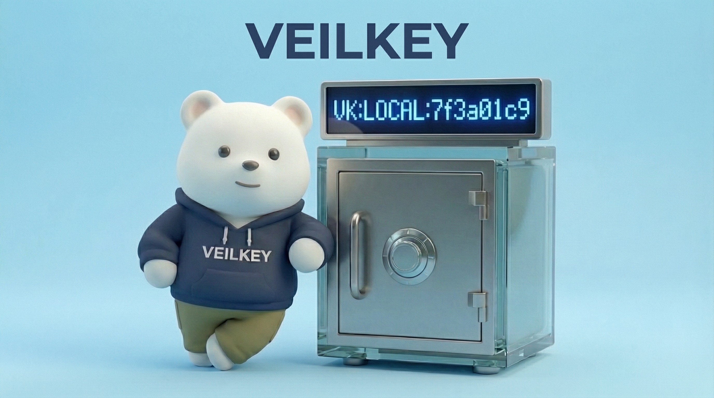

<div align="center">
  
  <h1>VeilKey Self-Hosted</h1>
  <p><strong>Hide secrets BEFORE they reach your terminal.</strong></p>
  <p>
    <a href="https://github.com/veilkey/veilkey-selfhosted/actions/workflows/ci.yml"></a>
    <a href="https://github.com/veilkey/veilkey-selfhosted/releases"></a>
    <a href="https://www.npmjs.com/package/veilkey-cli"></a>
    <a href="./LICENSE"></a>
  </p>
</div>

## The Problem

AI coding tools (Claude Code, Cursor, Copilot) read your terminal output, environment variables, and files.

If a password appears anywhere — even for a moment — **AI sees it.**

## The Solution

VeilKey wraps your terminal. Secrets never appear on screen.

```bash
# Without VeilKey — AI sees your password
$ echo $DB_PASSWORD
actual-password-here          ← AI reads this

# With VeilKey — AI sees only a reference
$ veil                        ← enter protected shell
$ echo $DB_PASSWORD
VK:LOCAL:ea2bfd16             ← AI reads this (encrypted ref)

# But your app still gets the real password
$ npm start                   ← DB_PASSWORD = actual-password-here
```

<div align="center">
  
  <p><em>AI sees <code>VK:AF1Y45</code>. The real key <code>PASS1234</code> stays hidden.</em></p>
</div>

## How It Works

```
You type a command
    ↓
VeilKey intercepts the output
    ↓
Passwords get replaced with VK:LOCAL:xxx references
    ↓
AI sees only the references — never the real values
    ↓
Your apps still receive the real passwords
```

VeilKey detects **222 secret patterns** automatically — AWS keys, GitHub tokens, API keys, passwords — even ones you haven't registered yet.

## Quick Start

### macOS

```bash
git clone https://github.com/veilkey/veilkey-selfhosted.git
cd veilkey-selfhosted
bash install/macos/bootstrap/install-all.sh
```

### Proxmox LXC (Debian)

```bash
git clone https://github.com/veilkey/veilkey-selfhosted.git
cd veilkey-selfhosted
CT_IP=<IP>/<MASK> CT_GW=<GATEWAY> bash install/proxmox-lxc-debian/install-veilkey.sh
```

After install, see [Post-Install Setup](./docs/setup/README.md) for initialization.

## Commands

```bash
veil                          # Enter protected shell
veil status                   # Check connection
veil resolve VK:LOCAL:xxx     # Decrypt a reference
veil exec echo VK:LOCAL:xxx   # Run command with real values
veil scan file.env            # Find secrets in files (222 patterns)
```

## Architecture

VeilKey splits secrets across two servers. **Both must be compromised** to access any secret.

```
VaultCenter                    LocalVault
┌────────────────────┐        ┌────────────────────┐
│ Encryption keys    │        │ Encrypted data     │
│ (can't read data   │        │ (can't decrypt     │
│  without data)     │        │  without keys)     │
└────────────────────┘        └────────────────────┘
         │                              │
         └──── both needed to read ────┘
```

| Component | What it stores | What it can do alone |
|-----------|---------------|---------------------|
| **VaultCenter** | Encryption keys | Nothing (no data) |
| **LocalVault** | Encrypted secrets | Nothing (no keys) |
| **veil CLI** | Nothing | Masks terminal output |

Every key operation is recorded on a **blockchain audit trail** — if someone tampers with the database, the chain breaks.

## What's Different?

| | 1Password CLI | Doppler | HashiCorp Vault | **VeilKey** |
|---|---|---|---|---|
| Store secrets | Yes | Yes | Yes | Yes |
| Inject env vars | Yes | Yes | Yes | Yes |
| **Hide from terminal output** | No | No | No | **Yes** |
| **Auto-detect secrets** | No | No | No | **Yes (222 patterns)** |
| **Blockchain audit** | No | No | No | **Yes** |
| **Split storage** | No | No | No | **Yes** |
| Self-hosted | No | No | Yes | **Yes** |

## Admin Panel

Two ways to manage VeilKey:

**Web UI** — open `https://<your-server>:10181/` in a browser

**TUI** — run `vaultcenter keycenter` in your terminal (no browser needed)

Both provide: secret management, vault browsing, audit logs, TOTP login, and server unlock.

## Server Restart

When the server restarts, secrets are locked. You must enter the master password to unlock.

```
Server starts → Locked
  → Enter master password (web UI or TUI)
  → Unlocked → normal operation
```

The password is **never stored on disk**. When the server shuts down, keys are wiped from memory.

## Security

**Never run AI tools as root.**

VeilKey hides secrets from AI, but root access can bypass any protection (memory dumps, raw file access).

**Best practices:**
- Always work inside `veil` shell
- Run AI tools as a regular user
- Do `sudo` operations outside veil

## Repository

```
services/
  vaultcenter/     # Key management server (Go)
  localvault/      # Encrypted storage (Go)
  veil-cli/        # Terminal wrapper (Rust)
packages/
  veil-cli/        # npm package
docker-compose.yml # Full stack
```

## Contributing

See [`CONTRIBUTING.md`](./CONTRIBUTING.md).

## License

MIT License. See [`LICENSE`](./LICENSE).

---

## Why I Built This

Been using AI coding tools a lot lately.
And something felt off.
They can see your terminal.

Which means... yeah, secrets too.
Even if it just flashes for a second.

Not a huge deal at first, but still.
Didn't feel right.

Secret managers don't really help here.
They protect storage, not this part.

So I hacked together something.

It sits between your program and the terminal
and swaps secrets before they show up.

Instead of:
`AWS_SECRET=abcd1234`

you get:
`VK:LOCAL:ea2bfd16`

But that's not all.
I introduced the concept of a local vault —
a way to manage ENV variables and passwords
that's more convenient than what we have now.

If you try it, you'll see.
I was so stressed by passwords scattered everywhere
that I wanted to propose this approach.

Going forward, AI should be able to manage our information safely.

I keep going back and forth on whether to keep this MIT or switch to AGPL-3.

In two months, I'll be bankrupt.

So here's the deal:
if this repo hits **10,000 stars by April 1st**, I'll keep it MIT.

If something's missing or broken, let me know.
I'll fix it.

https://github.com/veilkey/veilkey-selfhosted

---

<sub>Images in this README are AI-generated.</sub>
